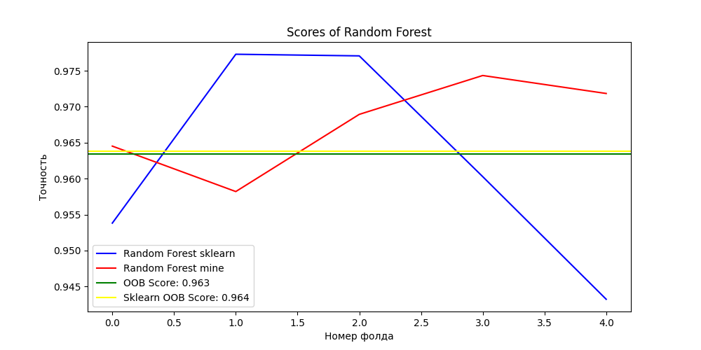
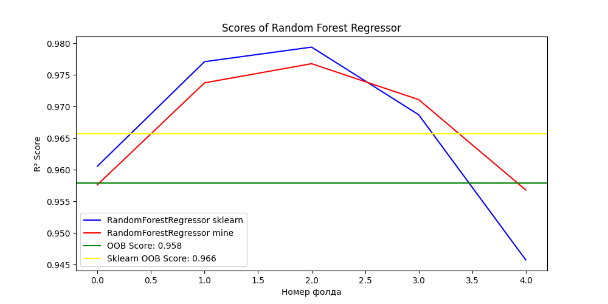
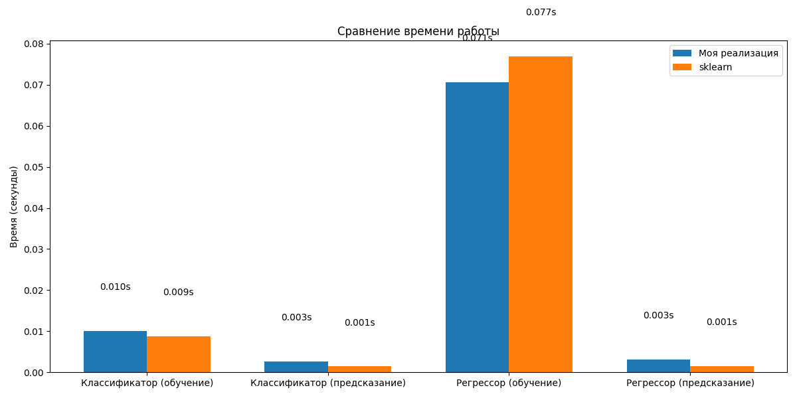

# Лабораторная работа №1: Реализация Random Forest

## Метрики производительности

### Классификация (датасет Breast Cancer)

#### Точность моделей

| Метрика | Моя реализация | Sklearn |
|---------|---------------|---------|
| OOB Score | 0.9420 | 0.9146 |
| Точность (кросс-валидация) | 0.9613 | 0.9596 |
| Точность на тестовой выборке | 0.9754 | 0.9649 |

#### Время выполнения

| Операция | Моя реализация (сек) | Sklearn (сек) |
|----------|----------------------|---------------|
| Обучение | 0.0100 | 0.0087 |
| Предсказание | 0.0026 | 0.0014 |

#### Оптимальные гиперпараметры

| Гиперпараметр | Значение |
|---------------|----------|
| Количество деревьев | 71 |
| Доля признаков | 0.4 |
| Размер выборки | 0.7 |

### Регрессия (датасет Housing)

#### Метрики качества

| Метрика | Моя реализация | Sklearn |
|---------|---------------|---------|
| R² (кросс-валидация) | 0.9677 | 0.9670 |
| MSE | 1118.90 | 1072.71 |
| MAE | 19.02 | 18.52 |

#### Время выполнения

| Операция | Моя реализация (сек) | Sklearn (сек) |
|----------|----------------------|---------------|
| Обучение | 0.0706 | 0.0769 |
| Предсказание | 0.0031 | 0.0015 |

## Визуализация результатов

### Классификация

### Регрессия

### Время

