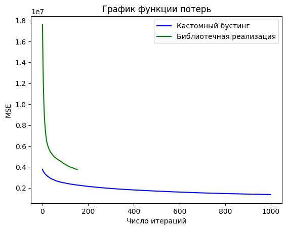

# Лабораторная работа №2

## Датасет

Для решения задачи был выбран датасет для предсказания цены авиабилетов ([ссылка](https://www.kaggle.com/datasets/shubhambathwal/flight-price-prediction)).

## Реализация
При инициализации алгоритма задается функция потерь, ее производная, макс. глубина дерева в ансамбле, а также шаг обучения и константа для критерия останова.

Далее в цикле (в пределах максимального числа итераций) осуществляется обучение: на первой итерации предсказывается таргет по обучающим данным, на последующих итерациях - градиент потерь для минимизации текущей ошибки. После вычисления и записи лосса и его производной проверяется условие останова: алгоритм завершает свою работу в случае наличия достаточного числа деревьев и разницы ошибок последнего и предпоследнего из них, меньшей, чем упомянутая ранее константа.

При предсказании алгоритм также сначала выдает прогноз по таргету базовым деревом, а последующие деревья постепенно корректируют ответ ансамбля.

## Сравнение с библиотечной реализацией 
### Метрики 
Кастомный алгоритм на 1000 итерациях показал `R^2 = 0.816`, в то время как библиотечная реализация достигла значения `R^2 = 0.793`.

### График функции потерь 


### Время обучения
Время работы кастомного алгоритма при 1000 итерациях: 14.06 с

Время обучения библиотечной реализации при 153 итерациях: 0.53 с

Для кросс-валидации использовалась функция ниже: 
```python
def cross_validate(model, X, y, n_folds=5):
    scores = []
    for n in range(n_folds):
        model_to_fit = copy.deepcopy(model)
        X_train, X_test, y_train, y_test = train_test_split(X, y, test_size=0.3)
        model_to_fit.fit(X_train, y_train)
        scores += [accuracy_score(y_test, model_to_fit.predict(X_test.to_numpy()))]
    return scores
```
На 20 выборках средний `R^2-score` кастомного алгоритма оказалась чуть выше (0.810 vs 0.769)