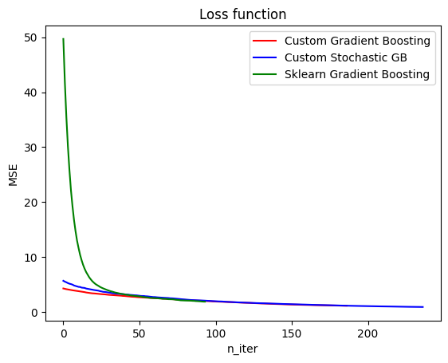

# Лабораторная работа №2

## Датасет
Для решения задачи регрессии используется датасет для предсказания расхода топлива в милях на галлон. Здесь [ссылка](https://www.kaggle.com/datasets/uciml/autompg-dataset) на датасет.

## Реализация методов

Реализованы два варианта алгоритма градиентного бустинга: обычный и стохастический.

Логика работы алгоритма следующая:

1. Инициализируется алгоритм: задается функция потерь (`loss_func`), её производная (`loss_grad`). Устанавливается максимальная глубина дерева в базовом алгоритме (`max_depth`) и скорость обучения (`lr`). При запуске обучения инициализируется максимальное число итераций (`n_iter`).

2. Обучение происходит в цикле:
    * инициализируется базовый алгоритм;
    * в случае, если текущая итерация - первая, базовый алгоритм обучается на предсказание таргета и рассчитывает предсказания на текущей тренировочной выборке. В ином случае, алгоритм обучается на предсказание градиента текущей ошибки, рассчитывает градиент и пересчитывает предсказания.
    * вычисляются функция потерь и её производная, добавляются в списки для сохранения;
    * если текущее значение функции потерь отличается от предыдущего менее чем на заданное значение `eps`, то обучение останавливается.

Логика работы стохастического алгоритма отличается тем, что на каждой итерации рандомно выбираются индексы, по которым формируется подвыборка из обучающей выборки. Базовые алгоритмы обучаются на этих подвыборках, градиенты или предсказания предсказываются на оригинальной выборке.

## Сравнение

### Время работы
* Время, затраченное кастомным алгоритмом на 187 итераций: 341.009 мс
* Время, затраченное кастомным стохастическим алгоритмом на 199 итераций: 482.992 мс
* Время, затраченное Sklearn алгоритмом на 56 итераций: 87.965 мс

По времени значительно выигрывает реализация sklearn. Стохастический аллгоритм работает медленнее из-за необходимости формирования подвыборки на каждой итерации.

### Функция потерь
<p align="center">
    
</p>

График отображает, как менялась функция потерь в процессе обучения. Можно заметить, что инициализация алгоритмов происходит по-разному: начальный `loss` алгоритма sklearn значительно больше, чем у кастомных. В процессе схождения графики становятся достаточно близки.


### Качество работы
Качество работы алгоритма определяется при помощи кросс-валидации. Для этого была написана следующая функция:
```python
def cross_validate(model, X, y, n_folds=5):
    scores = []
    for n in range(n_folds):
        model2fit = copy.deepcopy(model)
        X_train, X_test, y_train, y_test = train_test_split(X, y, test_size=0.2)
        model2fit.fit(X_train, y_train)
        scores += [r2_score(y_test, model2fit.predict(X_test))]
    return scores
```

Использовалась валидация на 20 выборках, оценка модели выполняется через метрику R2-score.

* Среднее R2-score для 20 выборок у кастомного алгоритма: 0.847
* Среднее R2-score для 20 выборок у стохастического алгоритма: 0.840
* Среднее R2-score для 20 выборок у Sklearn алгоритма: 0.855

Алгоритмы работают с достаточно близким качеством, которое сильно зависит от разделения выборки на train/test.
