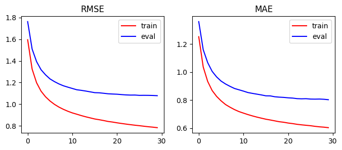

# Лабораторная работа №5

## Датасет
Для решения задачи построения рекомендаций для пользователя используется датасет с рейтингом фильмов [Movie Lens Dataset](https://grouplens.org/datasets/movielens/). Так как идентификаторы пользователей и фильмов нельзя использовать как индексы (начинаются не с 0 и не везде сохранен порядок), то добавляются колонки с индексами (`userIdx` и `movieIdx`).

## Реализация методов
Рекомендательная система основана на базе `latent factor model` (модель латентных факторов). Идея метода основана на разложении матриц предпочтений пользователей на скрытые факторы, которые помогают выявить взаимосвязи между пользователями и объектами.

При создании объекта LFM задаются следующие параметры: `n_clients` - общее количество пользователей, `n_objects`: общее количество объектов (в данном случае фильмов), `n_factors`: количество скрытых факторов (т. е. размерность пространства скрытого представления), `rating_interval`: диапазон возможных значений рейтинга. Также задаются параметры обучения: `lr`: скорость обучения градиентного спуска, `reg`: коэффициент регуляризации.

Инициализируются матрицы `p_ut` и `q_it`: представляют скрытые признаки пользователей и объектов соответственно. Рандомно инициализируются средний рейтинг фильмов (`r_i_mean`) и средний рейтинг пользователей (`r_u_mean`). Эти параметры также обучаемы.

В процессе обучения за одну эпоху модель проходит по каждой паре "пользователь - объект" в датасете. Вычисляется предсказание для пары, по ошибке обновляются параметры для данного пользователя и данного объекта. Также в формулах учтена регуляризация. После каждой эпохи происходит валидация на тренировочных и тестовых данных (и это занимает большую часть времени). Логгируются метрики (RMSE и MAE) и время обучения модели. 

## Результат 

Метрики по результатам обучения представлены в таблице. Чистое время обучения 12.46 c на 30 эпох.

| | RMSE | MAE |
|-|------|-----|
| train | 0.784 | 0.603 |
| test | 1.079 | 0.803 |

На графике представлено изменение метрики в процессе обучения.

    

## Сравнение
Эталонная реализация берется из библиотеки `scikit-surprise`.

| | RMSE | MAE | fit time | test time |
|-|------|-----|----------|-----------|
|custom| 1.079 | 0.8029 | 12.456 s | 778 ms |
|surprise| 0.873 | 0.67 | 1.05 s | 130 ms |

Результаты в целом достаточно близки. По времени обучения кастомный алгоритм работает примерно в 12 раз дольше, по метрикам разница порядка 0.1.