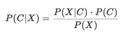
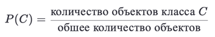
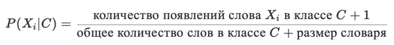
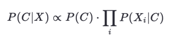
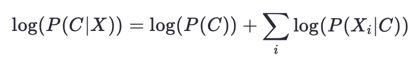

# Лабораторная работа №3. Наивный байесовский классификатор

В рамках данной лабораторной работы предстоит реализовать наивный байесовский классификатор и сравнить его с эталонной реализацией из библиотеки `scikit-learn`.

## Задание

1. Выбрать датасет для анализа, например, на [kaggle](https://www.kaggle.com/datasets).
2. Реализовать наивный байесовский классификатор.
3. Обучить модель на выбранном датасете.
4. Оценить качество модели с использованием кросс-валидации.
5. Замерить время обучения модели.
6. Сравнить результаты с эталонной реализацией из библиотеки [scikit-learn](https://scikit-learn.org/stable/):
   * точность модели;
   * время обучения.
7. Подготовить отчет, включающий:
   * описание наивного байесовского классификатора;
   * описание датасета;
   * результаты экспериментов;
   * сравнение с эталонной реализацией;
   * выводы.

## Решение

Для анализа был выбран датасет [SMS Spam Collection Dataset](https://www.kaggle.com/datasets/uciml/sms-spam-collection-dataset)

### Описание наивного байесовского классификатора

,

где:

* `P(C∣X)` — апостериорная вероятность класса C при заданных признаках X,
* `P(X∣C)` — правдоподобие признаков X для класса C,
* `P(C)` — априорная вероятность класса C,
* `P(X)` — вероятность признаков X.

Алгоритм работает следующим образом:

* Вычисляются априорные вероятности `P(C)` для каждого класса.
* Для каждого признака вычисляется вероятность `P(Xi|C)`
* Для нового объекта вычисляется вероятность принадлежности к каждому классу и выбирается класс с максимальной вероятностью.

Априорная вероятность класса `C` вычисляется как



Априорная вероятность признака `Xi` вычисляется с помощью сглаживания Лапласа, чтобы избежать нулевых вероятностей:



Апостериорная вероятность класса `C` вычисляется как



`P(X)` не зависит от класса, а значит является константой и поэтому его можно убрать из знаменателя и сравнивать только числитель. 

Чтобы избежать численной нестабильности, используется логарифмирование:



Далее выбирается класс `Ci` с наибольшим значением `log(P(Ci|X))`. 

### Реализация наивного байесовского классификатора

```python
import numpy as np

from collections import defaultdict


class NaiveBayesClassifier:
    def __init__(self):
        self.class_priors = {}
        self.word_likelihoods = defaultdict(dict)
        self.classes = None
        self.vocab = None

    def fit(self, X, y):
        self.classes, counts = np.unique(y, return_counts=True)
        self.class_priors = {cls: count / len(y) for cls, count in zip(self.classes, counts)}

        for cls in self.classes:
            cls_X = X[y == cls]
            total_words = 0
            word_counts = defaultdict(int)
            for doc in cls_X:
                words = doc.split()
                total_words += len(words)
                for word in words:
                    word_counts[word] += 1

            for word, count in word_counts.items():
                self.word_likelihoods[cls][word] = (count + 1) / (total_words + len(word_counts))

    def predict(self, X):
        predictions = []
        for doc in X:
            log_probs = {}
            for cls in self.classes:
                log_prob = np.log(self.class_priors[cls])
                for word in doc.split():
                    log_prob += np.log(self.word_likelihoods[cls].get(word, 1e-6))
                log_probs[cls] = log_prob
            predictions.append(max(log_probs, key=log_probs.get))
        return predictions
```

### Сравнение результатов

| Показатель      | Sklearn         | Custom          |
|-----------------|-----------------|-----------------|
| Время работы    | 0.0054          | 0.0143          |
| Accuracy        | 0.9839          | 0.9848          |
| Кросс-валидация | 0.9808 ± 0.0017 | 0.9961 ± 0.0057 |

## Выводы

* Собственная реализация показала среднюю точность 99.61%, что выше, чем у эталонной реализации (98.08%).
* Стандартное отклонение невелико (0.57%), что указывает на стабильность модели на разных фолдах.
* Скорость работы в два раза ниже, чем у реализации sklearn. Это можно объяснить использованием более эффективных структур данных. 
