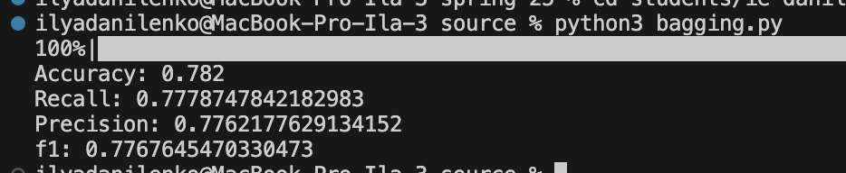
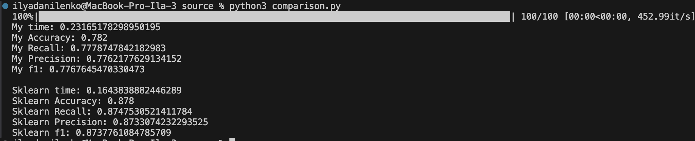

## Лабораторная работа №1. Ансамбли моделей

### Задание 1

Датасет классификации цен на мобильные телефоны:
https://www.kaggle.com/datasets/iabhishekofficial/mobile-price-classification?resource=download&select=train.csvs

### Задание 2
В файле [bagging.py](./source/bagging.py) реализован Random Forest с бэггингом. 

Краткие пояснения по коду:
Класс BaggingClassificator является реализацией алгоритма. API вызова схож с sklearn.ensemble.RandomForestClassifier.

### Задание 3
В скрипте В файле [bagging.py](./source/bagging.py) представлено обучение модели.

Метрики:

### Задание 4
В скрипте [comparison.py](./source/comparison.py) представлено сравнение RandomForestClassifier из sklearn и самописным решением.

Полученные результаты:
