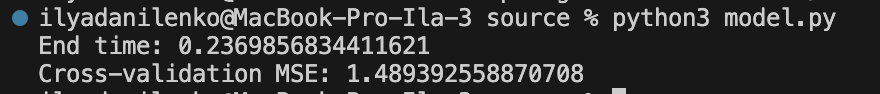
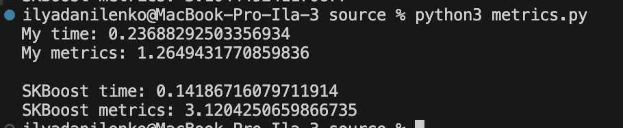

## Лабораторная работа №2. Градиентный бустинг

### Задание 1
Датасет опоссумов. Регрессия возраста животного.
https://www.kaggle.com/datasets/abrambeyer/openintro-possum

### Задание 2
В скрипте [model.py](./source/model.py) реализован градиентный бустинг. Класс GradientBoostingRegressor реализует данный алгоритм. API такой же, как у sklearn.ensemble.GradientBoostingRegressor.

### Задание 3, 4, 5
Данные задания сделаны в скрипте [model.py](./source/model.py). Реализована кросс-валидация KFold. Функция `cros_valid` выполняет обучение с кросс-валидацией, на фход принимает модель, данные для обучения, а также метод оценивания.

Полученные результаты:

### Задание 6
Сравнение происходит в скрипте [metrics.py](./source/metrics.py). Сравнение с sklearn.ensemble.GradientBoostingRegressor.

Получены следующие результаты:
