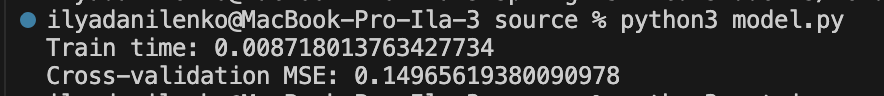
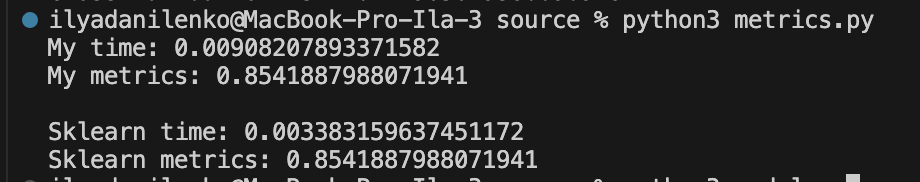

## Лабораторная работа №3. Наивный байесовский классификатор

### Задание 1

Датасет предсказания сердечной недостаточности. Классификация наличия сердечной недостаточности.

https://www.kaggle.com/datasets/fedesoriano/heart-failure-prediction

### Задание 2

В скрипте [model.py](./source/model.py) реализован наивный байесовский классификатор. Класс NaiveBayes реализует данный алгоритм. API такой же, как у sklearn.naive_bayes.GaussianNB.

### Задание 3, 4, 5

Данные задания сделаны в скрипте [model.py](./source/model.py). Реализована кросс-валидация KFold. Функция `cross_valid` выполняет обучение с кросс-валидацией, на вход принимает модель, данные для обучения, а также метод оценивания.

Полученные результаты:

### Задание 6

Сравнение происходит в скрипте [metrics.py](./source/metrics.py). Сравнение с sklearn.naive_bayes.GaussianNB.

Получены следующие результаты:

