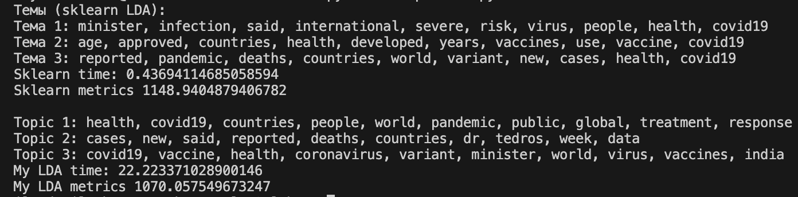

## Лабораторная работа №4. Латентное размещение Дирихле

### Задание 1

Датасет для анализа текста: 
https://www.kaggle.com/datasets/yashdogra/nlpdataset

Исходный датасет содержит неприемлимые символы не кодируемые в UTF-8. Поэтому для их очистки был написан скрипт [clean_data.py](./source/clean_data.py).

### Задание 2, 3
В скрипте [lda.py](./source//lda.py) представлена реализоация модель латентного размещения Дирихле с использованием алгоритма Гиббсовской выборки. Класс `LDA` реализует такое же API, как`sklearn.decomposition.LatentDirichletAllocation`.

### Задание 4
В скрипте [metrics.py](../source//metrics.py). Содержит функцию `perplexity` для вычисления метрики Perplexity для моделей LDA (поддерживает как собственную реализацию, так и sklearn).

### Задание 5, 6

В скрипте [comparison.py](././source/comparison.py) было реализовано сравнение самореализованного LDA и эталонного и sklearn.

Сравнение приведено на изображении:

Время выполнения моей модели сильно выше, чем у эталона. Однако метрика perplexity сравнима.
