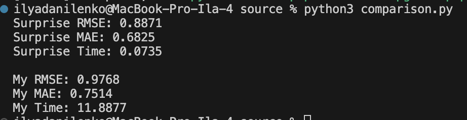

## Лабораторная работа №5. Модель латентных факторов (LFM)

### Задание 1

Датасет оценки рейтингов фильмов с 1996 по 2018 года
https://www.kaggle.com/datasets/shubhammehta21/movie-lens-small-latest-dataset

Чтение реализуется функцией `read_movies` в скрипте [read.py](./source/read.py).

### Задание 2
Модель латентных факторов (LFM) реализована классом `LFM` в скриптер [lfm.py](./source/lfm.py). API как в Sklearn.

Ключевая особенность реализации в качестве данных можно использовать pandas DataFrame, созданный чтением таблицы с следующими столбцами: `userId`, `movieId` , `rating`.

### Задание 3, 4, 5, 6
В качестве эталонной реализации исполльзовался SVD из бибилиотеки surprise. (Ставим на Python 3.11.9 с numpy 1.26.3, чтобы не страдать!!!).

Оценка метрик RMSE и MAE были реализованы в скрипте [metrics.py](./source/metrics.py) с помощью соотвествующих функций.

Само сравнение происходит в скрипте [comparison.py](./source/comparison.py).

Результаты сравнения:

По результатам. Метрики сравнимы друг с другом. Моя реализация имеет метрики чуть хуже, однако это вопрос настройки параметров. Время обучения моей модели конечно же сильно больше.