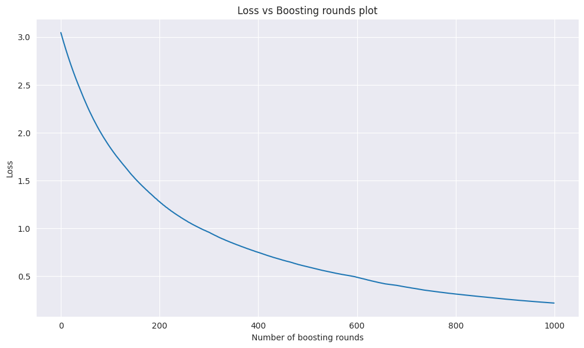

# Лабораторная работа №2. Градиентный бустинг

## Описание работы

В рамках данной лабораторной работы был реализован алгоритм **градиентного бустинга** для задачи регрессии и проведено сравнение с эталонной реализацией из библиотеки scikit-learn.

## Описание датасета

Для экспериментов использовался датасет **Possum** ([`possum.csv`](https://www.kaggle.com/datasets/abrambeyer/openintro-possum)):
- **Задача**: Регрессия (предсказание возраста животного)
- **Целевая переменная**: `age` - возраст опоссума
- **Признаки**: 
  - `Pop` - популяция (категориальный признак, закодирован LabelEncoder)
  - `sex` - пол (категориальный признак, закодирован LabelEncoder)
  - Другие числовые признаки
- **Предобработка**: Удаление пропущенных значений, кодирование категориальных признаков
- **Разделение**: 80% для обучения, 20% для тестирования

## Реализованные алгоритмы

### 1. Градиентный бустинг (GradientBoostingRegressor)

Алгоритм градиентного бустинга последовательно обучает слабые регрессоры (деревья решений), каждый из которых корректирует ошибки предыдущих моделей путем аппроксимации градиентов функции потерь.

**Ключевые особенности реализации:**
- Использование среднего значения целевой переменной как начального приближения
- Вычисление градиентов функции потерь (MSE): `-(y_true - y_pred)`
- Последовательное обучение деревьев решений на градиентах
- Использование коэффициента обучения (learning rate) для контроля вклада каждого дерева

**Параметры модели:**
- `n_estimators` - количество деревьев
- `learning_rate` - коэффициент обучения
- `max_depth` - максимальная глубина деревьев

### 2. Кросс-валидация (KFold)

Собственная реализация k-fold кросс-валидации для оценки качества модели:
- Разделение данных на k равных частей
- Поочередное использование каждой части как валидационной выборки
- Возможность перемешивания данных перед разделением

## Результаты экспериментов

### Основные эксперименты

**Конфигурация моделей:**
- Собственная реализация: `n_estimators=200, max_depth=32, learning_rate=0.001`
- Scikit-learn: `n_estimators=200, max_depth=32, learning_rate=0.001, criterion="squared_error"`
- Кросс-валидация: 5 фолдов
- Метрика: Mean Squared Error (MSE)

### Сравнение результатов

| Модель | MSE (среднее по CV) | Время обучения |
|--------|-------------------|----------------|
| **Собственная реализация** | 3.32 | 2.45 секунд |
| **Scikit-learn** | 3.18 | 1.09 секунд |

### График

### Анализ результатов

**Качество модели:**
- Обе реализации показали сопоставимые результаты по качеству предсказания

**Производительность:**
- Библиотечная реализация работает примерно в 2.2 раза быстрее

## Описание алгоритма градиентного бустинга

Градиентный бустинг — это итеративный алгоритм машинного обучения, который строит ансамбль слабых моделей путем последовательной минимизации функции потерь.

**Основные шаги алгоритма:**

1. **Инициализация**: Начальное приближение как среднее значение целевой переменной
2. **Итеративное обучение**: 
   - Вычисление градиентов функции потерь для текущих предсказаний
   - Обучение нового слабого регрессора на градиентах
   - Обновление предсказаний с учетом нового регрессора и коэффициента обучения
3. **Финальное предсказание**: Сумма всех слабых моделей с соответствующими весами

## Выводы

1. **Корректность реализации**: Собственная реализация градиентного бустинга работает корректно и показывает результаты, сопоставимые с библиотечной версией.

2. **Качество алгоритма**: Градиентный бустинг эффективно решает задачу регрессии на выбранном датасете, достигая низких значений MSE.

3. **Производительность**: Хотя собственная реализация уступает по скорости библиотечной, разница не критична для образовательных и исследовательских задач.
