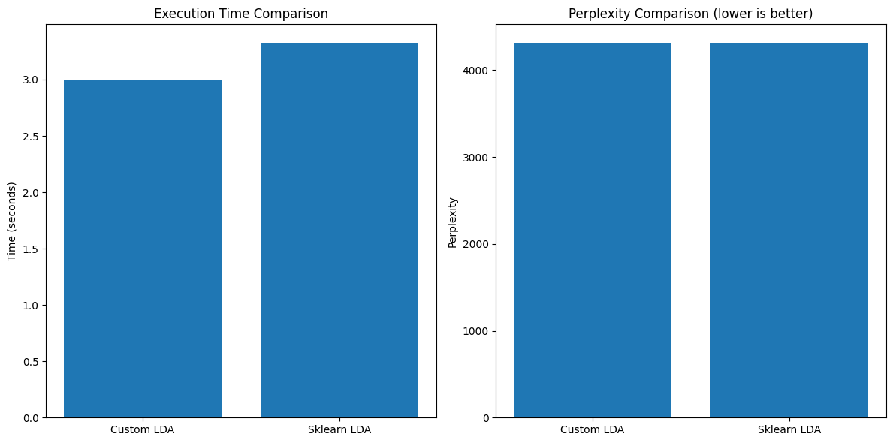

# Лабораторная работа №4. Латентное размещение Дирихле (LDA)

## Описание работы

В рамках данной лабораторной работы была реализована **модель латентного размещения Дирихле (Latent Dirichlet Allocation, LDA)** для задачи тематического моделирования текстовых документов. Проведено сравнение с эталонной реализацией LDA из библиотеки scikit-learn.

## Описание датасета

Для экспериментов использовался датасет **ABC News Headlines**:
- **Источник**: CSV файл с заголовками новостей ABC News
- **Размер**: 101 документ (выборка из 100-201 записей)
- **Содержание**: Заголовки новостных статей на английском языке

## Реализованный алгоритм

### Латентное размещение Дирихле (LDA)

LDA представляет собой генеративную вероятностную модель для коллекции дискретных данных, таких как текстовые корпуса. Модель предполагает, что каждый документ представляет собой смесь тем, а каждая тема характеризуется распределением слов.

## Результаты экспериментов

### Основное сравнение

**Конфигурация моделей:**
- Собственная реализация: `n_topics=4, α=0.1, β=0.01, max_iter=500`
- Scikit-learn LDA: `n_components=4, doc_topic_prior=0.1, topic_word_prior=0.01, max_iter=500`

### Результаты производительности

| Метрика | Собственная реализация (LDA) | Scikit-learn LDA |
|---------|------------------------------|------------------|
| **Время обучения** | 3.0019 секунд | 3.3243 секунды |
| **Перплексия** | 4311.59 | 4309.90  |

## График

## Описание алгоритма латентного размещения Дирихле

Латентное размещение Дирихле (LDA) — это порождающая статистическая модель, которая позволяет объяснить наблюдения посредством неявных групп, что дает возможность объяснить, почему некоторые части данных похожи.

**Основные предположения модели:**
1. Каждый документ представляет собой смесь тем
2. Каждая тема характеризуется распределением слов
3. Процесс генерации документа происходит следующим образом:
   - Для каждого документа выбирается распределение тем из распределения Дирихле
   - Для каждого слова в документе:
     - Выбирается тема согласно распределению тем документа
     - Выбирается слово согласно распределению слов выбранной темы

**Преимущества алгоритма:**
- Автоматическое выявление скрытых тематических структур в текстах
- Вероятностная природа модели позволяет учитывать неопределенность
- Гибкость в выборе количества тем

**Области применения:**
- Тематическое моделирование корпусов документов
- Анализ научных публикаций и патентов
- Исследование социальных сетей и новостных потоков
- Рекомендательные системы на основе контента
- Анализ отзывов и мнений пользователей

## Выводы

1. **Эффективность подхода**: Алгоритм LDA эффективно выявляет скрытые тематические структуры в текстовых данных, обеспечивая интерпретируемые и когерентные темы.

2. **Производительность**: Хотя собственная реализация уступает по скорости оптимизированной библиотечной версии, она демонстрирует приемлемую производительность и позволяет глубже понять принципы работы алгоритма.