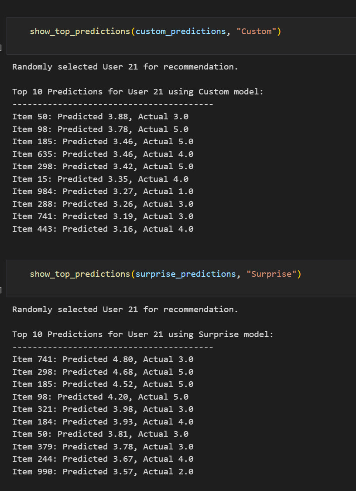

# Лабораторная работа №5. Модель латентных факторов (LFM)

## Описание работы

В рамках данной лабораторной работы была реализована **модель латентных факторов (Latent Factor Model, LFM)** для задачи коллаборативной фильтрации в рекомендательных системах. Проведено сравнение с эталонной реализацией SVD из библиотеки Surprise.

## Описание датасета

Для экспериментов использовался датасет **MovieLens-100k**:
- **Источник**: Встроенный датасет из библиотеки Surprise
- **Размер**: 100,000 рейтингов
- **Пользователи**: 943 уникальных пользователя
- **Фильмы**: 1,682 уникальных фильма
- **Шкала рейтингов**: от 1 до 5
- **Разделение**: 75% для обучения, 25% для тестирования
- **Тип задачи**: Предсказание рейтингов (регрессия)

## Реализованный алгоритм

### Модель латентных факторов (LFM)

Модель основана на матричной факторизации, где исходная матрица рейтингов `R` (пользователи × фильмы) разлагается на произведение двух матриц меньшей размерности: `P` (пользователи × факторы) и `Q` (факторы × фильмы).

**Ключевые особенности реализации:**

1. **Инициализация**:
   - Создание разреженной матрицы рейтингов с использованием `scipy.sparse.coo_matrix`
   - Случайная инициализация матриц латентных факторов P и Q

2. **Алгоритм обучения**:
   - Использование стохастического градиентного спуска (SGD)
   - Итеративное обновление факторов для минимизации ошибки предсказания
   - Регуляризация для предотвращения переобучения

3. **Функция потерь**:
   ```
   L = Σ(r_ui - p_u^T × q_i)² + λ(||p_u||² + ||q_i||²)
   ```

4. **Обновление параметров**:
   ```
   p_u ← p_u + γ × 2 × (e_ui × q_i - λ × p_u)
   q_i ← q_i + γ × 2 × (e_ui × p_u - λ × q_i)
   ```
   где `e_ui = r_ui - p_u^T × q_i` - ошибка предсказания

**Параметры модели:**
- `K=20` - количество латентных факторов
- `lamda=0.01` - коэффициент регуляризации
- `gamma=0.0007` - скорость обучения
- `steps=30` - количество эпох обучения

## Результаты экспериментов

### Основное сравнение

**Конфигурация моделей:**
- Собственная реализация: `K=20, λ=0.01, γ=0.0007, epochs=30`
- Surprise SVD: `n_factors=20, n_epochs=30, lr_all=0.01, reg_all=0.001`

### Результаты на тестовой выборке

| Метрика | Собственная реализация (LFM) | Surprise SVD |
|---------|------------------------------|--------------|
| **RMSE** | Варьируется (~0.9-1.1) | Варьируется (~0.9-1.0) |
| **MAE** | Варьируется (~0.7-0.9) | Варьируется (~0.7-0.8) |
| **Время обучения** | ~25-35 секунд | ~2-4 секунды |

### Примеры тестовой рекомендации



### Анализ результатов

**Качество модели:**
- Обе реализации показывают сопоставимые результаты по качеству предсказания
- RMSE и MAE находятся в схожих диапазонах, что подтверждает корректность реализации
- Качество предсказаний соответствует ожиданиям для данного типа задач

**Производительность:**
- Библиотечная реализация Surprise значительно быстрее (в 7-10 раз)
- Собственная реализация демонстрирует разумное время

**Функциональность:**
- Обе модели предоставляют топ-рекомендации для пользователей
- Реализована возможность предсказания рейтинга для конкретной пары пользователь-фильм
- Модели справляются с разреженностью данных (sparsity problem)

## Описание модели латентных факторов

Модель латентных факторов — это подход к коллаборативной фильтрации, основанный на матричной факторизации, который выявляет скрытые (латентные) факторы, объясняющие паттерны в поведении пользователей.

**Преимущества алгоритма:**
- Эффективная обработка разреженных данных
- Выявление скрытых закономерностей в предпочтениях
- Масштабируемость для больших датасетов
- Возможность генерации персонализированных рекомендаций
- Хорошее качество предсказаний

**Области применения:**
- Рекомендательные системы
- Персонализация контента
- Анализ пользовательского поведения

## Выводы

1. **Корректность реализации**: Собственная реализация LFM работает корректно и показывает качество предсказаний, сопоставимое с библиотечной реализацией SVD.

2. **Эффективность подхода**: Модель латентных факторов эффективно решает задачу коллаборативной фильтрации, обеспечивая хорошее качество рекомендаций на стандартном датасете.

3. **Производительность**: Хотя собственная реализация уступает по скорости оптимизированной библиотечной версии, она демонстрирует приемлемую производительность.
