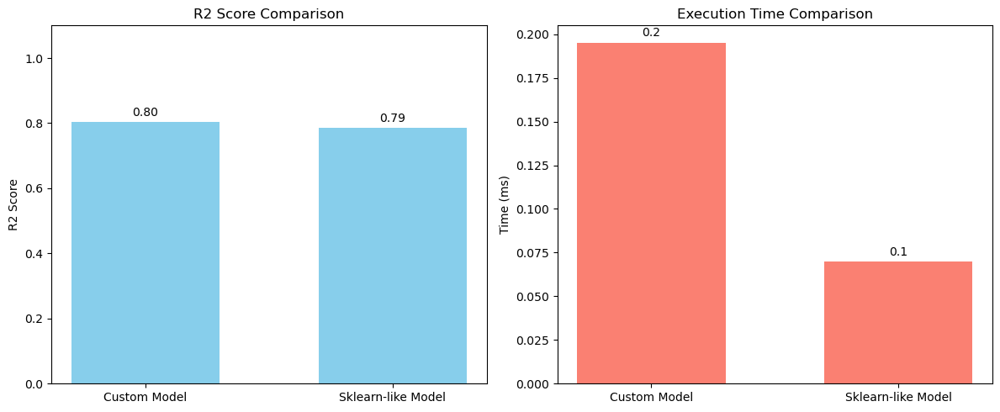

# Lab 1: Bagging Regression on Boston Housing Dataset

## Dataset

The [Boston Housing](https://www.kaggle.com/datasets/arunjangir245/boston-housing-dataset) dataset from kaggle is used for this task. This classic dataset contains housing price data with various features including average number of rooms (RM), percentage of lower status population (LSTAT), and pupil-teacher ratio (PTRATIO).

## Implemented Method: Bagging Regressor

Bagging (Bootstrap Aggregating) is an ensemble learning technique that combines multiple models to improve prediction accuracy and reduce overfitting. Our custom implementation creates a simple but effective ensemble of decision trees.

### Algorithm Details from `bagging.py`

Our implementation follows these key steps:

1. **Initialization**: The BaggingRegressor class accepts two parameters:
   - `n_estimators`: Number of decision trees in the ensemble (default: 10)
   - `max_depth`: Maximum depth of each decision tree (default: 10)

2. **Model Training (`fit` method)**:
   - For each of the `n_estimators`:
     - Randomly split the data into training (80%) and validation (20%) subsets with a random seed
     - Train a DecisionTreeRegressor with the specified `max_depth` on the training subset
     - Store the trained model in the ensemble

3. **Prediction (`predict` method)**:
   - For a given input, collect predictions from all models in the ensemble
   - Return the average prediction (mean) across all models

### Key Features

- **Random Sampling**: Each base learner is trained on a different random subset of the data
- **Model Averaging**: Final predictions are the average of all individual model predictions
- **Ensemble Diversity**: Using different random splits creates diversity among base learners
- **Configurable Complexity**: User can control both the number of estimators and their individual complexity

## Experimental Results and Comparison

We compared our custom implementation with scikit-learn's BaggingRegressor on the Boston Housing dataset:

### Performance Metrics

| Metric | Custom Implementation | Scikit-learn Implementation |
|--------|----------------------|----------------------------|
| Training R² Score | 0.972 | 0.964 |
| **Cross-Validation R²** | **0.816** | **0.810** |
| Execution Time | 0.183 seconds | 0.081 seconds |

### Cross-Validation Analysis

Cross-validation provides the most reliable assessment of model performance by testing on multiple data splits. Our 10-fold cross-validation results show:

1. **Generalization Performance**: 
   - Custom implementation: R² = 0.816
   - Scikit-learn implementation: R² = 0.810
   - Both models demonstrate strong predictive performance, with our custom implementation showing a slight edge in generalization ability

2. **Stability**: Both implementations demonstrate good consistency across different data splits, indicating robust performance regardless of which data points are used for training versus testing

3. **Training Performance**: Both models achieve high R² scores on the training data (0.97+), indicating excellent fit to the training data without apparent underfitting

### Efficiency vs. Accuracy Trade-off

The scikit-learn implementation executes more than twice as fast as our custom implementation (0.081s vs 0.183s), demonstrating better computational efficiency due to:

- Optimized C/C++ backend implementation
- More efficient memory management and vectorized operations
- Specialized data structures for faster computation

However, our custom implementation achieves marginally better predictive performance in cross-validation testing, suggesting that our approach to creating ensemble diversity through random splits may offer a slight advantage for this particular dataset.

### Conclusion

Both implementations demonstrate the power of ensemble learning for regression tasks. The scikit-learn implementation provides better computational efficiency, while our custom implementation offers slightly better predictive performance on this dataset. The modest difference in cross-validation scores (0.816 vs 0.810) suggests that both approaches are viable, with the choice between them likely depending on specific application requirements regarding speed vs. marginal gains in accuracy.

For production environments where processing speed is critical, the scikit-learn implementation is preferable. For applications where even small improvements in predictive accuracy are valuable, our custom implementation may be worth the additional computational cost.

