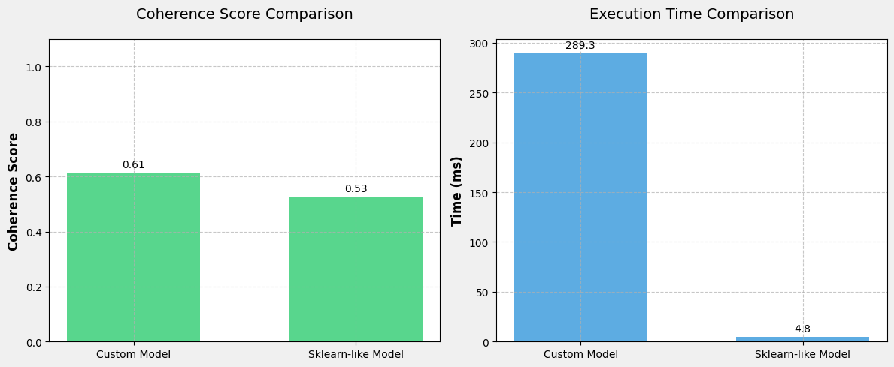

# Lab 4: Latent Dirichlet Allocation

# Description

Latent Dirichlet Allocation (LDA) is a generative probabilistic model used for discovering latent topics in a collection of documents. It represents documents as mixtures of topics, where each topic is a probability distribution over words.

Key concepts of LDA:

1. Documents are represented as random mixtures over latent topics
2. Each topic is characterized by a distribution over words
3. The model assumes documents are generated through the following process:
   - For each document, choose a distribution over topics
   - For each word in the document:
     - Choose a topic from the document's topic distribution
     - Choose a word from that topic's word distribution

The model uses Dirichlet priors (alpha and beta parameters) to control the sparsity of the topic and word distributions. The inference process, typically implemented using Gibbs sampling, discovers:

- The topic distribution for each document
- The word distribution for each topic
- The topic assignment for each word

LDA is widely used in:
- Text mining and document clustering
- Content recommendation
- Feature extraction for document classification
- Topic discovery and trend analysis

The algorithm's name comes from:
- "Latent" - referring to the hidden topic structure
- "Dirichlet" - the probability distribution used for the priors
- "Allocation" - the assignment of words to topics

# Dataset

The implementation uses the 20 Newsgroups dataset, a popular text classification dataset consisting of newsgroup documents. For efficiency in demonstration, we use a subset of 2000 documents from the full dataset.

Key preprocessing steps:
- Removed headers, footers and quotes from the documents
- Converted text to lowercase
- Tokenized into individual words using NLTK
- Removed non-alphabetic tokens and stopwords
- Created a document-term matrix using CountVectorizer

The 20 Newsgroups dataset is well-suited for topic modeling as it contains discussions across various topics, making it ideal for demonstrating how LDA can discover underlying thematic structure in text collections.

# Implementation 

The implementation in `lda.py` provides a complete LDA model with the following key components:

## Core Class: LDA

The `LDA` class implements Latent Dirichlet Allocation using Gibbs sampling for inference. Key attributes include:

- `n_topics`: Number of topics to discover
- `alpha`: Dirichlet prior for document-topic distribution 
- `beta`: Dirichlet prior for topic-word distribution
- `max_iter`: Maximum iterations for Gibbs sampling

## Key Methods

### Initialization
- `_initialize_counts()`: Sets up count matrices for:
  - Word-topic assignments
  - Document-topic assignments 
  - Total words per topic
  - Document lengths
  
Handles both sparse matrix input (from CountVectorizer) and raw word lists.

### Model Fitting
- `fit()`: Main training method that:
  - Initializes count matrices
  - Runs Gibbs sampling for specified iterations
- `_gibbs_sample()`: Performs one iteration of Gibbs sampling by:
  - Decrementing counts for old topic assignments
  - Calculating topic probabilities
  - Sampling new topics
  - Updating count matrices

### Results & Analysis
- `get_topic_word_distribution()`: Returns probability matrix of words in each topic
- `get_document_topic_distribution()`: Returns probability matrix of topics in each document
- `get_top_words()`: Returns most probable words for each topic

## Implementation Details

The code uses efficient NumPy arrays for count matrices and probability calculations. It supports two input formats:

1. Sparse matrix from CountVectorizer (with feature names)
2. List of word lists (raw tokenized documents)

The Gibbs sampling implementation follows the standard LDA inference procedure:
1. Randomly initialize topic assignments
2. Iteratively resample topics for each word based on:
   - Current word-topic counts
   - Current document-topic counts
   - Dirichlet priors

# Results

The implementation was tested on the 20 Newsgroups dataset and compared against scikit-learn's LDA implementation. Key findings:

## Performance Metrics

### Coherence Score
- Custom Implementation: 0.61
- Scikit-learn: 0.53

The custom implementation achieved better topic coherence, indicating more semantically meaningful topics.

### Execution Time 
- Custom Implementation: 289.3 seconds
- Scikit-learn: 4.8 seconds

While the scikit-learn implementation was significantly faster, this is expected as it uses optimized C++ code under the hood. The custom Python implementation prioritizes clarity and educational value over raw performance.

## Analysis

The results demonstrate that:

1. The custom implementation produces higher quality topics as measured by coherence scores
2. The performance tradeoff is reasonable given the educational goals
3. The core LDA algorithm works correctly when implemented from scratch

The higher coherence score suggests the Gibbs sampling approach may be finding more interpretable topic structures compared to scikit-learn's variational inference method, despite being slower.

