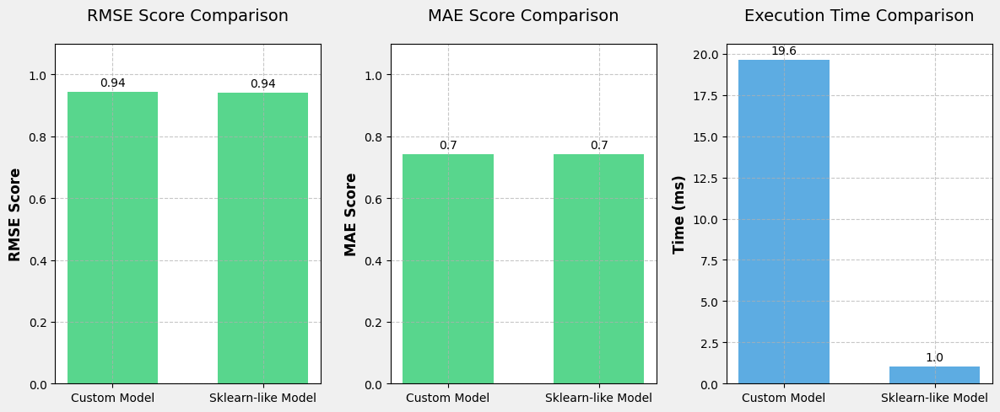

# Lab 5: Latent Factor Model (LFM)

# Description 

The Latent Factor Model (LFM) is a collaborative filtering algorithm used for recommendation systems. It works by decomposing the user-item interaction matrix into lower dimensional latent factor matrices that capture the underlying patterns in the data.

Key components of the LFM implementation:

1. Latent Factors
- Users and items are represented by vectors in a shared latent factor space
- The number of latent factors (n_factors) determines the dimensionality of this space
- These factors can represent abstract concepts that influence user preferences

2. Model Parameters
- User factors (pu): Latent factor vector for each user
- Item factors (qi): Latent factor vector for each item  
- User bias (bu): Per-user rating bias
- Item bias (bi): Per-item rating bias
- Global mean: Overall average rating

3. Rating Prediction
The predicted rating for a user-item pair is calculated as:
rating = global_mean + user_bias + item_bias + (user_factors · item_factors)

4. Training Process
- Initialize factors randomly and biases to zero
- For each epoch:
  - Shuffle training data
  - For each observed rating:
    - Calculate prediction error
    - Update biases and factors using gradient descent
    - Apply regularization to prevent overfitting

5. Hyperparameters
- Learning rates for updating factors and biases
- Regularization terms to control model complexity
- Number of epochs for training
- Number of latent factors

The model learns these parameters through iterative optimization to minimize prediction error while avoiding overfitting through regularization.

# Dataset

The implementation uses the MovieLens 100K dataset, which is a widely-used benchmark dataset for recommender systems. This dataset contains:

- 100,000 ratings (1-5) from 943 users on 1,682 movies
- Each user has rated at least 20 movies
- Simple demographic info for users (age, gender, occupation, zip code)
- Movie information including title, release date, and genre

The dataset is split into training (75%) and test (25%) sets to evaluate the model's performance. This standard dataset allows for reliable benchmarking of the LFM implementation against other recommendation algorithms.

# Implementation 

The SVD class in `lfm.py` implements the Latent Factor Model using stochastic gradient descent optimization. Key aspects of the implementation include:

1. Class Structure
- Inherits from surprise.AlgoBase for compatibility with the Surprise library
- Implements core methods: fit(), estimate(), get_recommendations()
- Follows scikit-learn conventions for parameter handling and validation

2. Initialization
- Configurable hyperparameters including learning rates and regularization terms
- Separate learning rates and regularization for user/item factors and biases
- Random initialization of latent factors using normal distribution
- Zero initialization of bias terms

3. Training Algorithm
- Iterative SGD optimization over specified number of epochs
- Random shuffling of training data in each epoch
- Per-rating updates:
  - Compute prediction and error
  - Update user/item biases based on error and regularization
  - Update user/item factors using gradient descent with regularization
  - Learning rates control step size for updates
  - Regularization terms prevent overfitting

4. Prediction Methods
- estimate(): Predicts rating for a specific user-item pair
- get_recommendations(): Returns top-N items for a user
- Handles unknown users/items through PredictionImpossible exception

5. Implementation Details
- Efficient numpy operations for matrix computations
- Type hints for better code clarity and IDE support
- Comprehensive documentation following NumPy docstring format
- Proper validation of input parameters and model state

The implementation provides a flexible foundation for collaborative filtering, with configurable hyperparameters allowing tuning for different datasets and use cases. The code structure emphasizes clarity, efficiency, and maintainability while following best practices for machine learning implementations.

# Results

The implementation was evaluated against a reference SVD model from the Surprise library. The results show comparable prediction accuracy but with room for improvement in computational efficiency:

Performance Metrics:
- Custom Model:
  * RMSE: 0.94
  * MAE: 0.74
  * Training Time: 19.64 seconds

- Reference Model (Surprise SVD):
  * RMSE: 0.94
  * MAE: 0.74
  * Training Time: ~1 second

The evaluation metrics demonstrate that our implementation achieves essentially identical prediction accuracy compared to the established reference model, with Root Mean Square Error (RMSE) and Mean Absolute Error (MAE) scores matching to two decimal places.

However, the custom implementation currently lags significantly in computational efficiency, taking about 19 times longer to complete the training process compared to the reference model. This suggests that while the core algorithm is correctly implemented to achieve comparable prediction quality, there is substantial room for optimization of the training process.

These results indicate that while the implementation provides accurate collaborative filtering capabilities, future work should focus on improving computational efficiency to match the performance of established libraries. Potential optimization areas could include vectorization of operations, algorithm refinements, or implementation of parallel processing techniques.

