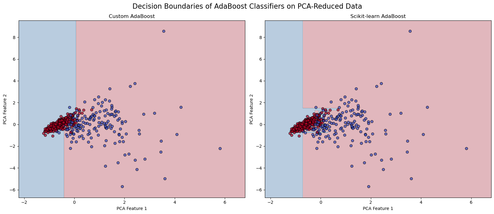

# Отчёт по лабораторной работе №1
## Реализация алгоритма AdaBoost

### Описание метода

В данной лабораторной работе я реализовал алгоритм AdaBoost (Adaptive Boosting) - ансамблевый метод машинного обучения, который последовательно обучает набор "слабых" классификаторов, где каждый последующий классификатор фокусируется на исправлении ошибок предыдущих.

Особенности реализации:
- В качестве базовых классификаторов используются деревья решений с глубиной 1 (решающие пни/data stumps)
- Для каждого классификатора вычисляется вес, зависящий от его точности
- На каждой итерации пересчитываются веса обучающих экземпляров: увеличиваются веса неправильно классифицированных образцов
- Финальное предсказание формируется как взвешенное голосование всех классификаторов

### Описание набора данных

Для экспериментов был использован набор данных по раку молочной железы (Breast Cancer Wisconsin Dataset):

- Размерность данных: 569 экземпляров × 30 признаков
- Количество классов: 2 (доброкачественная или злокачественная опухоль)
- Распределение классов: 212 злокачественных и 357 доброкачественных образцов

Данные были разделены на обучающую (80%) и тестовую (20%) выборки с использованием стратификации для сохранения пропорции классов.

### Экспериментальные результаты

Были проведены следующие эксперименты:

1. Обучение кастамной реализации AdaBoost и измерение времени обучения
2. Оценка точности на тестовой выборке
3. Проведение кросс-валидации для оценки стабильности модели
4. Сравнение с реализацией AdaBoost из библиотеки scikit-learn
5. Визуализация границ принятия решений после снижения размерности методом PCA

Результаты показали:
- Точность кастомной реализации на тестовом наборе: 97.37%
- Средняя точность при кросс-валидации: 92.54% ± 0.44%
- Время обучения кастомной реализации: 0.0288 секунд

### Сравнение с эталонной реализацией

| Метрика | Собственная реализация | Scikit-learn AdaBoost |
|---------------------|-------------------|----------------------|
| Точность на тесте   | 97.37%            | 97.37%               |
| Кросс-валидация     | 92.54% ± 0.44%    | 97.37% ± 1.84%       |
| Время обучения (сек)| 0.0288            | 0.3535               |

Обе реализации показали одинаковую точность на тестовых данных (97.37%), но реализация из scikit-learn продемонстрировала более высокие результаты в кросс-валидации. При этом моя реализация оказалась быстрее.

Визуализация границ принятия решений на данных, преобразованных методом PCA, показывает, что обе реализации формируют схожие разделяющие поверхности.

### Выводы

1. Разработанная кастомная реализация алгоритма AdaBoost показывает результаты, сопоставимые с реализацией из библиотеки scikit-learn.

2. Кастомная реализация обладает значительно меньшим временем обучения, что может быть полезно при работе с большими объемами данных.

3. Однако, реализация scikit-learn демонстрирует более стабильные результаты при кросс-валидации, что может указывать на её лучшую обобщающую способность.
