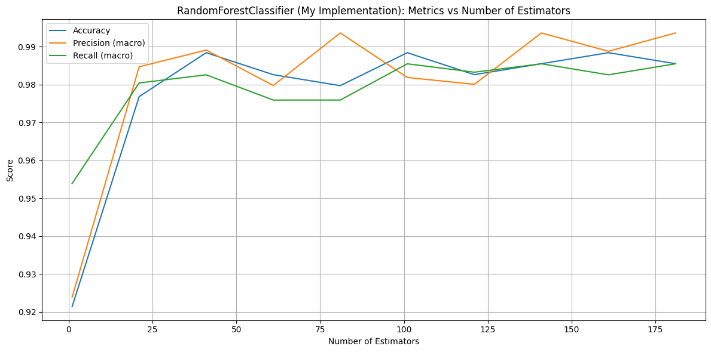
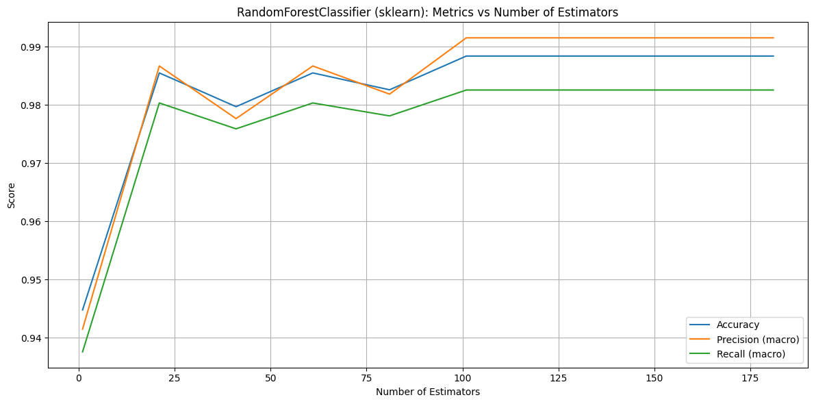
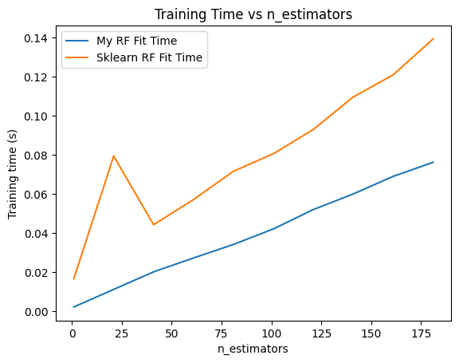
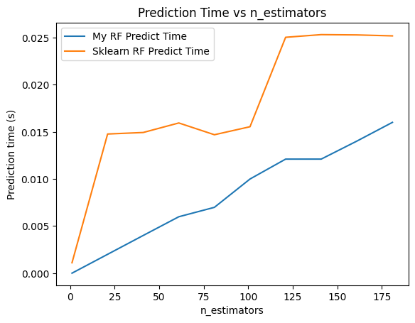

# Лабораторная работа №1. Ансамбли моделей

## 📚 Теория

**Случайный лес (Random Forest)** — это ансамблевый метод машинного обучения, основанный на построении множества деревьев решений и объединении их предсказаний. Он применяется как для задач классификации, так и для регрессии. Метод сочетает **бэггинг (bootstrap aggregating)** и **случайный выбор признаков**, чтобы уменьшить переобучение и повысить точность модели.

---

### 🧠 Принцип работы

1. **Bootstrap-выборка**:
   Для каждого дерева $T_k$ из общего количества деревьев $n$ случайным образом выбирается подмножество обучающей выборки $D_k$ с возвращением:

   $$
   D_k = \{(x_i, y_i)\}_{i=1}^m,\quad x_i, y_i \sim D
   $$

2. **Случайный выбор признаков**:
   При каждом разбиении в узле дерева случайно выбирается подмножество признаков $F_k \subseteq F$, где:

   $$
   |F_k| = \sqrt{p} \quad \text{(для классификации)}
   $$

   где $p$ — общее количество признаков.

3. **Построение дерева**:
   Каждое дерево обучается независимо на своей выборке и случайных признаках при каждом разбиении.

4. **Агрегация предсказаний**:
   - Для **классификации** применяется **голосование большинством**:

     $$
     \hat{y} = \text{mode}\left( T_1(x), T_2(x), \dots, T_n(x) \right)
     $$

   - Для **регрессии** — усреднение:

     $$
     \hat{y} = \frac{1}{n} \sum_{k=1}^n T_k(x)
     $$

---

📎 *Случайный лес снижает дисперсию модели за счёт ансамблирования, сохраняя при этом низкий уровень смещения.*

---

## 📊 Сравнительные метрики

| Классфикатор                    | Кол-во деревьев | ✅ Accuracy | 🎯 Precision | 📢 Recall |
|--------------------------------|------------------|-------------|---------------|------------|
| MyRandomForestClassifier       | 41               | 0.9884      | 0.9891        | 0.9826     |
| Sklearn RandomForestClassifier | 101              | 0.9884      | 0.9915        | 0.9826     |

## 📉 Графики метрик

### 🔍 Accuracy, Precision, Recall vs. Кол-во деревьев для собственной реализации Random Forest

### 🔍 Accuracy, Precision, Recall vs. Кол-во деревьев для sklearn реализации Random Forest

## ⏱️ Время выполнения

### ⌛ Время обучения (Training Time)

### ⌛ Время предсказания (Prediction Time)

---

