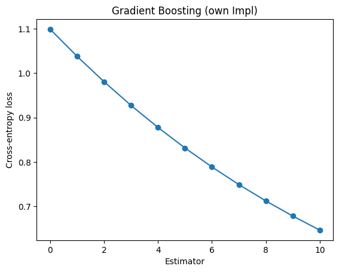

# Лабораторная работа №2. Градиентный Бустинг

## Теоретические основы бустинга

Бустинг представляет собой метод построения композиции алгоритмов (множества «слабых» моделей), где каждый новый алгоритм пытается компенсировать ошибки предыдущих.

## Аддитивная модель

Пусть задана выборка $\{(x_i, y_i)\}_{i=1}^N$, где $x_i\in \mathbb{R}^d$ — признаки, $y_i$ — целевое значение (класс или число). Бустинг строит итоговую функцию $F_M(x)$ в виде суммы нескольких «слабых» алгоритмов $h_m(x)$:

$$
F_M(x) = \sum_{m=1}^{M} \gamma_m \, h_m(x),
$$

где $M$ — число итераций (число «слабых» моделей), $\gamma_m$ — коэффициент (learning rate или масштаб) при $m$-м алгоритме.

## Градиентный бустинг

В градиентном бустинге на $m$-м шаге мы приближенно оптимизируем функцию потерь $L$. Для текущей композиции $F_{m-1}(x)$ вычисляем псевдо-остатки:

$$
r_{im} \;=\; - \left[ \frac{\partial L\bigl(y_i, F(x_i)\bigr)}{\partial F(x_i)} \right]_{F(x)=F_{m-1}(x)},
$$

после чего обучаем «слабый» алгоритм $h_m(x)$ приближать $r_m$, и обновляем композицию:

$$
F_m(x) = F_{m-1}(x) + \nu \cdot h_m(x),
$$

где $\nu$ — коэффициент обучения (learning rate).

### Случай многоклассовой классификации

Для задачи многоклассовой классификации, если мы используем функцию потерь типа кросс-энтропии, после каждого обновления оценку для класса $k$ можно превращать в вероятность через softmax:

$$
P_k(x) = \frac{\exp(F_k(x))}{\sum_{j}\exp(F_j(x))},
$$

где $F_k(x)$ — итоговый «скор» для класса $k$. Градиенты в этом случае связаны с отклонением $P_k(x)$ от «one-hot» представления истинных меток $y$.

---

# Описание датасета Palmer Penguins

Использовался датасет **Palmer Penguins**, содержащий наблюдения за тремя видами пингвинов: Adelie, Chinstrap, Gentoo. Основные признаки:

- `bill_length_mm` — длина клюва (мм);
- `bill_depth_mm` — глубина (толщина) клюва (мм);
- `flipper_length_mm` — длина ласты (мм);
- `body_mass_g` — масса тела (г);
- `island` — остров обитания;
- `sex` — пол;
- `year` — год наблюдения;
- `species` — вид пингвина (*целевая переменная*).

В датасете могут присутствовать пропуски, которые заполняются мерами центральной тенденции.

---

# Результаты экспериментов

В ходе эксперимента для классификации трех видов пингвинов были получены следующие средние показатели точности (Accuracy) при 5-кратной кросс-валидации (n_estimators = 10):

- `My Accuracy: 0.9491 ± 0.0212`
- `Sklearn Accuracy: 0.9636 ± 0.0230`
- `XGB Accuracy: 0.9673 ± 0.0212`


| Model    | Class | Precision | Recall | F1-Score | Support |
|----------|-------|-----------|--------|----------|---------|
| **MyImpl** | 0     | 1.00      | 0.94   | 0.97     | 32      |
|          | 1     | 0.87      | 1.00   | 0.93     | 13      |
|          | 2     | 1.00      | 1.00   | 1.00     | 24      |
|          | **Accuracy** | | | 0.97 | 69 |
|          | **Macro Avg** | 0.96 | 0.98 | 0.97 | 69 |
|          | **Weighted Avg** | 0.97 | 0.97 | 0.97 | 69 |
| **Sklearn** | 0     | 1.00      | 1.00   | 1.00     | 32      |
|          | 1     | 1.00      | 1.00   | 1.00     | 13      |
|          | 2     | 1.00      | 1.00   | 1.00     | 24      |
|          | **Accuracy** | | | 1.00 | 69 |
|          | **Macro Avg** | 1.00 | 1.00 | 1.00 | 69 |
|          | **Weighted Avg** | 1.00 | 1.00 | 1.00 | 69 |
| **XGB** | 0     | 1.00      | 1.00   | 1.00     | 32      |
|          | 1     | 1.00      | 1.00   | 1.00     | 13      |
|          | 2     | 1.00      | 1.00   | 1.00     | 24      |
|          | **Accuracy** | | | 1.00 | 69 |
|          | **Macro Avg** | 1.00 | 1.00 | 1.00 | 69 |
|          | **Weighted Avg** | 1.00 | 1.00 | 1.00 | 69 |

**Значение функции ошибки на каждом оценщике:**


# Примечания

## [Bias-variance decomposition](https://education.yandex.ru/handbook/ml/article/bias-variance-decomposition) 
Здесь хорошо расписана декомпозиция на примере MSE.

## [Ансамбли](https://education.yandex.ru/handbook/ml/article/ansambli-v-mashinnom-obuchenii)

**Цитата про уменьшение смещения в бустинге:**

```
Каждый следующий базовый алгоритм в бустинге обучается так, чтобы уменьшить общую ошибку всех своих предшественников. Как следствие, итоговая композиция будет иметь меньшее смещение, чем каждый отдельный базовый алгоритм (хотя уменьшение разброса также может происходить).

Поскольку основная цель бустинга — уменьшение смещения, в качестве базовых алгоритмов часто выбирают алгоритмы с высоким смещением и небольшим разбросом. Например, если в качестве базовых классификаторов выступают деревья, то их глубина должна быть небольшой — обычно не больше 2-3 уровней.
```

**Цитата про уменьшение разброса в беггинге (там есть математические выкладки, здесь только выводы):**

```
...
Получилось, что в этом случае дисперсия композиции в k раз меньше дисперсии отдельного алгоритма.
...
По этому рисунку видно, что общая дисперсия предсказаний в зависимости от обучающего множества у бэггинга значительно ниже, чем у отдельных деревьев, а в среднем предсказания деревьев и бэггинга не отличаются.
```

## [Градиентный бустинг](https://education.yandex.ru/handbook/ml/article/gradientnyj-busting)
Здесь расписано как они приходят к идее Градиентного бустинга на основе того, что в обычном бустинге следующая модель обучается на "остатках" (разнице между таргетом и предсказанием), что в случае MSE является антиградиентом. Далее это обобщается на другие функции.