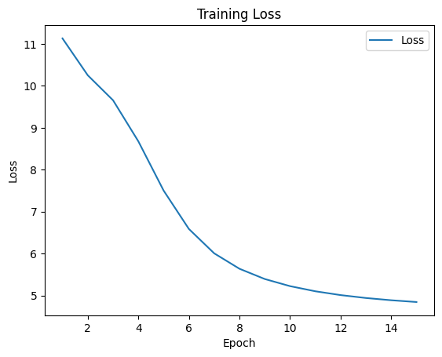
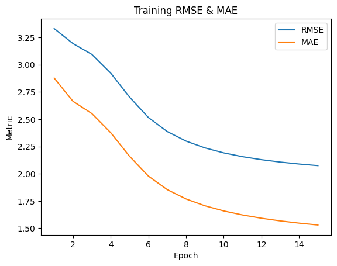

# Лабораторная работа №5. Latent Factor Model

1. **Теория алгоритма**

   В основе Latent Factor Model (LFM) лежит идея матричной факторизации: мы приближаем матрицу наблюдаемых рейтингов $R\in\mathbb{R}^{m\times n}$ (пользователи $\times$ объекты) произведением двух матриц низкой ранга:

   $$
   R \approx \hat R = PQ^T,
   $$

   где

   * $P\in\mathbb{R}^{m\times k}$ — матрица факторов пользователей,
   * $Q\in\mathbb{R}^{n\times k}$ — матрица факторов объектов,
   * $k \ll \min(m,n)$ — число скрытых факторов.

   Чтобы учесть систематические отклонения рейтингов, вводят смещения (bias) и глобальное среднее:

   $$
   \hat r_{ui} = \mu + b_u + b_i + p_u^T q_i,
   $$

   где

   * $\mu$ — общее среднее по всем рейтингам,
   * $b\_u$ — смещение пользователя $u$,
   * $b\_i$ — смещение объекта $i$,
   * $p\_u, q\_i\in\mathbb{R}^k$ — вектора факторов.

   Целевая функция при обучении минимизирует сумму квадратов ошибок с регуляризацией:

   $$
   L = \sum_{(u,i)\in\mathcal{K}} \bigl(r_{ui} - \hat r_{ui}\bigr)^2 + \lambda\Bigl(\|P\|_F^2 + \|Q\|_F^2 + \sum_u b_u^2 + \sum_i b_i^2\Bigr),
   $$

   где $\mathcal{K}$ — множество наблюдаемых пар $(u,i)$, а $\lambda$ — коэффициент регуляризации.
   Для оптимизации обычно применяют стохастический градиентный спуск (SGD), обновляя параметры по формулам вида:

   $$
   \begin{aligned}
   p_u &\leftarrow p_u + \eta\bigl(e_{ui}\,q_i - \lambda\,p_u\bigr),\\
   q_i &\leftarrow q_i + \eta\bigl(e_{ui}\,p_u - \lambda\,q_i\bigr),\\
   b_u &\leftarrow b_u + \eta\bigl(e_{ui} - \lambda\,b_u\bigr),\\
   b_i &\leftarrow b_i + \eta\bigl(e_{ui} - \lambda\,b_i\bigr),
   \end{aligned}
   $$

   где $e\_{ui}=r\_{ui}-\hat r\_{ui}$ и $\eta$ — скорость обучения.

2. **Описание предобработки и датасета**

   Датасет состоит из двух таблиц:

   * **`user-filtered.csv`** — содержит колонки `user_id`, `anime_id`, `rating`.
   * **`anime-filtered.csv`** — содержит информацию об аниме, в том числе `anime_id` и `English name`.

   Этапы предобработки:

   1. **Построение словаря**: каждому `anime_id` сопоставляется его английское название.
   2. **Индексация**: всем уникальным `user_id` и `anime_id` присваиваются внутренние индексы (0…$m-1$ и 0…$n-1$).
   3. **Сборка разреженной матрицы**: создаётся CSR-матрица размера $m\times n$, где в позициях $(u,i)$ стоит рейтинг $r\_{ui}$, а неоценённые пары хранятся неявно как нули.
   4. **Разбиение на train/test**: из всех ненулевых значений случайным образом отбирается 25 % для теста (остальное остаётся в обучающей матрице).

3. **Результаты экспериментов**

   **3.1. LatentFactorModel**

   | Метрика | Значение |
   | :------ | -------: |
   | RMSE    |   3.6594 |
   | MAE     |   2.8231 |

   **3.2. Surprise SVD (5-fold CV)**

   | Fold     |       RMSE |        MAE |
   | :------- | ---------: | ---------: |
   | 1        |     3.4814 |     2.7347 |
   | 2        |     3.4842 |     2.7368 |
   | 3        |     3.4921 |     2.7441 |
   | 4        |     3.4942 |     2.7473 |
   | 5        |     3.5080 |     2.7646 |
   | **Mean** | **3.4920** | **2.7455** |
   | **Std**  |     0.0093 |     0.0106 |

   **3.3. Графики обучения**

   * **Рисунок 1**. График изменения функции потерь $L$ по эпохам:

   
   * **Рисунок 2**. График метрик RMSE и MAE:

   

4. **Время работы**

   | Алгоритм              | Fit / Train      | Test / Predict       |
   | :-------------------- | :--------------- | :------------------- |
   | **LatentFactorModel** | ~4.0 s per epoch | 9.51 ms ± 207 μs |
   | **Surprise SVD**      | 1.01 s ± 0.02 s  | 0.15 s ± 0.04 s      |

   * LatentFactorModel замерялся за 7 прогонов по 100 циклов (`%timeit` в Jupyter).
   * Surprise SVD — усреднённые времена по 5 фолдам (fit и тест).

---
